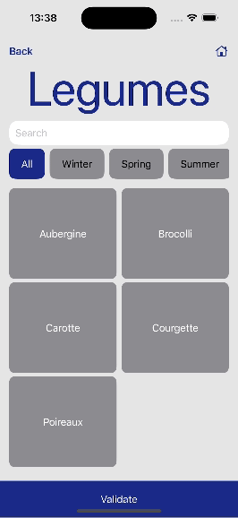
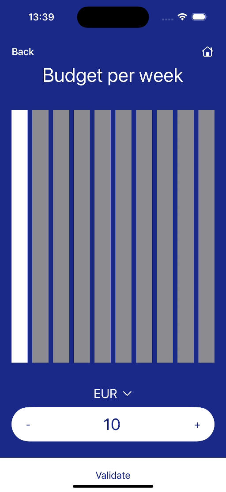
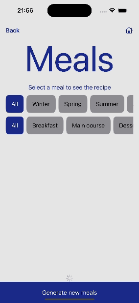

# meals-creator-ai
Generate menus based on user-preferences thanks to the OpenAI API (iOS / Swift)

## Screenshots

First, the user has to log in with Apple or Google.

Now logged in, he enters his name and first name.

He chooses his food preferences and the tools he owns.

He selects informations such his budget, the number of persons he cooks for and the time he spent to cook.

 /

Then he selects the type and the season of the meals he wants to generate meals according his preferences.

 /

